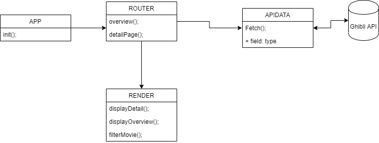
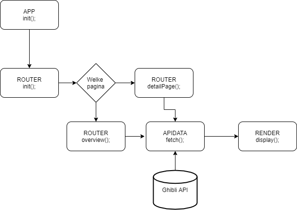

# Web App From Scratch @cmda-minor-web 1819

In this course you will learn to build a web application without frameworks or unnecessary libraries, but with vanilla HTML, CSS & JavaScript as much as possible. The end result is a modular, single page web app (SPA). Data will be retrieved from an external API of your choice, manipulated and finally shown in the UI of the App. You will learn different ways to structure code and develope your own coding style. With the gained knowledge you will be able to build interactive prototypes, based on real data. Also you will gain a better understanding of the how API's, frameworks and libraries work.

## Learning goals

* _You can add structure to your code by applying patterns. You can defend the choice for the chosen patterns_
* _You can retrieve data, manipulate it and dynamically convert it to html elements using templating_
* _You understand how you can work with an external API using asynchronous code_
* _You understand how you can manage state in your application and you inform the user of state where necessary_

## Program

### Week 1 - Hello API 🐒

Goal: Retrieve data from an API and render it in an overview page.

### Week 2 - Design and Refactor 🛠

Goal: Design the web app. Add routes and states. Rendering detail page.

### Week 3 - Wrapping up 🎁

Goal:
Manipulate data. Split code into modules. Reflect on end result

# Studio Ghibli movie discription
<!-- ☝️ replace this description with a description of your own work -->

### introduction
<!-- Add a nice poster image here at the end of the week, showing off your shiny frontend 📸 -->
This site will show you the descriptions of the movies from the famous Ghibli anime studio.
## Table of contents
<!-- Maybe a table of contents here? 📚 -->
- [Live demo](#Live-Demo)
- [Installation](#Installation)
- [features](#Features)
- [API](#API)
- [App design](#App-design)
- [built with](#built-with)
- [Todo](#todo)
- [Wishlist](#wishlist)

## Live demo
Link to the site: [link](https://heralt.github.io/web-app-from-scratch-1920/)
<!-- Add a link to your live demo in Github Pages 🌐-->
## Installation

<!-- Add a link to your live demo in Github Pages 🌐-->
## Features
- Showsmovie description of studio Ghibli movies. 
## API
The api that I used for this project is the [Ghibli API](https://ghibliapi.herokuapp.com/#section/Studio-Ghibli-API). This API 
gives you information about 20 studio Ghibli movies. There is no key needed to access the api and there is no request limit.  ## Installation
To get access to this API you can use the Fetch API. You don't need a key to get access.
## App design
These are the diagrams that reflect the final app designs I want to achieve.
#### actor diagram

#### interaction diagram

## built with
- [x] [Routie](http://projects.jga.me/routie/), a javascript routing library.
- [ ] Transperancy
## Todo
- [x] Enabling viewing of different movies
## Wishlist
- [ ] Ability to filter different movies
- [ ] Using template engine for templating 